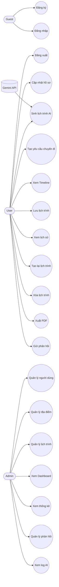
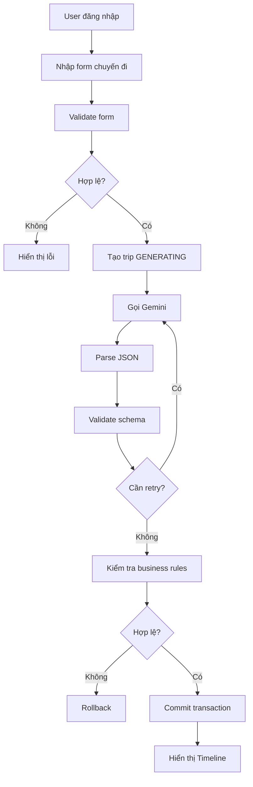
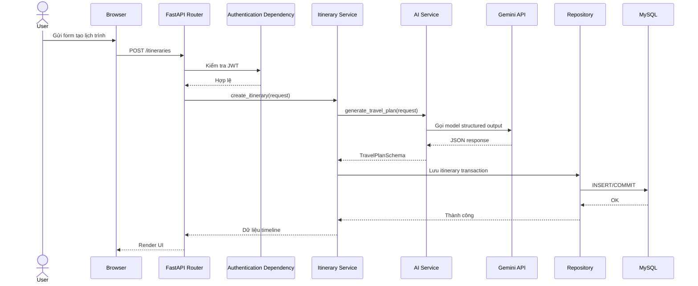
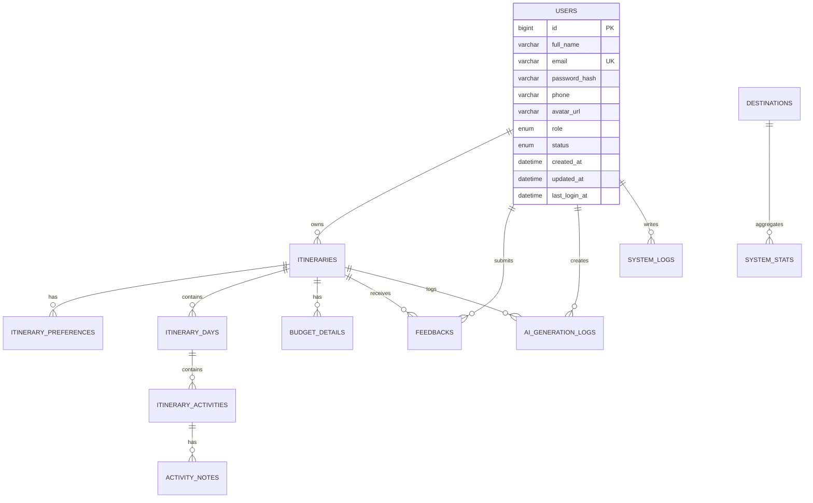

# Giai đoạn 1 và 2

## 1.1 Phân tích yêu cầu

### Bài toán thực tế
Người dùng muốn tạo lịch trình du lịch cá nhân hóa theo ngân sách, ngày đi, sở thích, phong cách du lịch và các ràng buộc thực tế. Hệ thống cần dùng Generative AI để tạo lịch trình chi tiết nhưng vẫn phải kiểm soát dữ liệu bằng validation và business rules.

### Lý do chọn đề tài
Đề tài có tính ứng dụng cao, phù hợp đồ án tốt nghiệp, kết hợp đầy đủ backend, database, AI, bảo mật, và hiển thị dữ liệu trực quan.

### Mục tiêu hệ thống
- Sinh lịch trình AI có cấu trúc chuẩn.
- Lưu lịch trình và lịch sử chuyến đi.
- Hỗ trợ timeline và PDF.
- Có authentication, authorization và dashboard quản trị.

### Phạm vi hệ thống
- MVP web app trên FastAPI + MySQL.
- Hỗ trợ người dùng và quản trị viên.
- Tích hợp Gemini API để sinh lịch trình.

### Đối tượng sử dụng
- Guest.
- User.
- Admin.

### Yêu cầu chức năng
- Đăng ký, đăng nhập, đăng xuất.
- Quản lý hồ sơ.
- Tạo lịch trình AI.
- Xem timeline, lịch sử, PDF.
- Admin xem dashboard, thống kê, quản lý người dùng, chuyến đi, địa điểm, phản hồi, log AI.

### Yêu cầu phi chức năng
- Bảo mật JWT, bcrypt, phân quyền.
- Có validation và transaction.
- Responsive, tiếng Việt.
- Logging, retry, rate limiting.

### Quy tắc nghiệp vụ
- Start date không nhỏ hơn hiện tại.
- Số ngày 1-30.
- Adults >= 1.
- Children >= 0.
- Budget > 0.
- User chỉ xem dữ liệu của mình.
- Không lưu một phần nếu parse hoặc DB fail.

### Giới hạn
- Gemini có thể trả JSON sai schema.
- Một số tính năng phụ thuộc môi trường PDF.
- Chưa triển khai toàn bộ UI trong giai đoạn này.

### Rủi ro kỹ thuật
- SDK thay đổi theo phiên bản.
- Structured output có thể còn schema subset.
- Gemini có thể timeout, quota, rate limit.
- WeasyPrint trên Windows có thể khó cài đặt.

### Hướng mở rộng
- Refresh token đầy đủ.
- Tìm kiếm địa điểm nâng cao.
- Cache, queue, background job.
- Tích hợp bản đồ và recommendation engine.

## 1.2 Kiến trúc hệ thống

### Phân lớp
- Presentation Layer: Jinja2, HTML, CSS, JS, Bootstrap.
- Template và Static Layer: render giao diện và tài nguyên tĩnh.
- REST API Layer: FastAPI routers.
- Authentication và Authorization Layer: JWT, dependencies, permissions.
- Service Layer: business logic, orchestration, AI, PDF.
- Repository Layer: truy vấn ORM và transaction.
- ORM Model Layer: SQLAlchemy models.
- MySQL Database: lưu users, itineraries, days, activities, logs, feedback.
- Gemini External Service: sinh lịch trình structured output.
- PDF Generation Service: render lịch trình sang PDF.

### Luồng dữ liệu


## 1.3 Cấu trúc thư mục

```text
personalized-travel-planner/
├── app/
│   ├── main.py
│   ├── config.py
│   ├── database.py
│   ├── dependencies.py
│   ├── core/
│   ├── models/
│   ├── schemas/
│   ├── repositories/
│   ├── services/
│   ├── api/
│   ├── templates/
│   ├── static/
│   └── utils/
├── alembic/
├── tests/
├── scripts/
├── docs/
├── generated_pdfs/
├── .env.example
├── requirements.txt
├── README.md
└── run.py
```

### Chức năng chính
- `app/config.py`: đọc và validate env.
- `app/core/exceptions.py`: exception AI.
- `app/schemas/ai_response.py`: schema JSON Gemini.
- `app/schemas/itinerary.py`: request schema.
- `app/utils/json_parser.py`: bóc JSON từ response.
- `app/services/ai_service.py`: gọi Gemini và validate business rules.

## 1.4 Use Case Diagram



## 1.5 Activity Diagram



## 1.6 Sequence Diagram



## 1.7 Thiết kế ERD

### Bảng chính
- `users`: tài khoản người dùng và admin.
- `itineraries`: hồ sơ chuyến đi.
- `itinerary_preferences`: sở thích, yêu cầu, hoạt động cần tránh.
- `itinerary_days`: từng ngày trong lịch trình.
- `itinerary_activities`: hoạt động theo ngày.
- `activity_notes`: ghi chú cho hoạt động.
- `budget_details`: phân bổ ngân sách.
- `destinations`: danh mục địa điểm.
- `feedbacks`: phản hồi người dùng.
- `ai_generation_logs`: log gọi AI.
- `system_stats`: dữ liệu thống kê theo ngày.
- `system_logs`: nhật ký hệ thống.

### Thuộc tính ràng buộc
- `users.email` unique, indexed.
- `users.role` chỉ `USER` hoặc `ADMIN`.
- `users.status` chỉ `ACTIVE`, `LOCKED`, `INACTIVE`.
- `itineraries.status` chỉ `DRAFT`, `GENERATING`, `COMPLETED`, `FAILED`, `CANCELLED`.
- `budget_details.category` là enum giới hạn.
- `feedbacks.rating` từ 1 đến 5.
- `itinerary_days.day_number` unique theo itinerary.
- `itinerary_activities.period` chỉ `morning`, `afternoon`, `evening`.

### Tóm tắt bảng

#### users
| Cột | Kiểu | PK/FK | Nullable | Default | Unique | Ý nghĩa |
|---|---|---|---|---|---|---|
| id | BIGINT | PK | No | AI | Yes | Khóa chính |
| full_name | VARCHAR(255) |  | No |  |  | Họ tên |
| email | VARCHAR(255) |  | No |  | Yes | Đăng nhập |
| password_hash | VARCHAR(255) |  | No |  |  | Mật khẩu hash |
| phone | VARCHAR(20) |  | Yes |  | No | Số điện thoại |
| avatar_url | VARCHAR(500) |  | Yes |  | No | Ảnh đại diện |
| role | ENUM |  | No | USER | No | Quyền |
| status | ENUM |  | No | ACTIVE | No | Trạng thái |
| created_at | DATETIME |  | No | NOW | No | Tạo mới |
| updated_at | DATETIME |  | No | NOW | No | Cập nhật |
| last_login_at | DATETIME |  | Yes |  | No | Lần đăng nhập cuối |

#### itineraries
| Cột | Kiểu | PK/FK | Nullable | Default | Unique | Ý nghĩa |
|---|---|---|---|---|---|---|
| id | BIGINT | PK | No | AI | Yes | Khóa chính |
| user_id | BIGINT | FK(users.id) | No |  | No | Chủ sở hữu |
| trip_title | VARCHAR(255) |  | No |  | No | Tên chuyến đi |
| origin | VARCHAR(255) |  | No |  | No | Điểm xuất phát |
| destination | VARCHAR(255) |  | No |  | No | Điểm đến |
| country | VARCHAR(255) |  | Yes |  | No | Quốc gia |
| start_date | DATE |  | No |  | No | Ngày bắt đầu |
| end_date | DATE |  | No |  | No | Ngày kết thúc |
| number_of_days | INT |  | No |  | No | Số ngày |
| adults | INT |  | No |  | No | Số người lớn |
| children | INT |  | No | 0 | No | Số trẻ em |
| total_budget | DECIMAL(12,2) |  | No |  | No | Ngân sách |
| currency | VARCHAR(12) |  | No | VND | No | Tiền tệ |
| transportation_preference | VARCHAR(255) |  | Yes |  | No | Phương tiện |
| accommodation_preference | VARCHAR(255) |  | Yes |  | No | Chỗ ở |
| travel_pace | VARCHAR(100) |  | Yes |  | No | Nhịp độ |
| special_requirements | TEXT |  | Yes |  | No | Yêu cầu đặc biệt |
| status | ENUM |  | No | DRAFT | No | Trạng thái trip |
| ai_status | VARCHAR(50) |  | No | PENDING | No | Trạng thái AI |
| ai_model | VARCHAR(100) |  | Yes |  | No | Model dùng |
| ai_processing_time_ms | INT |  | Yes |  | No | Thời gian xử lý |
| estimated_total_cost | DECIMAL(12,2) |  | Yes |  | No | Tổng chi phí dự kiến |
| summary | TEXT |  | Yes |  | No | Tóm tắt |
| raw_ai_response | LONGTEXT |  | Yes |  | No | Phản hồi thô |
| created_at | DATETIME |  | No | NOW | No | Tạo mới |
| updated_at | DATETIME |  | No | NOW | No | Cập nhật |

#### itinerary_preferences
| Cột | Kiểu | PK/FK | Nullable | Default | Unique | Ý nghĩa |
|---|---|---|---|---|---|---|
| id | BIGINT | PK | No | AI | Yes | Khóa chính |
| itinerary_id | BIGINT | FK(itineraries.id) | No |  | No | Thuộc trip |
| preference_type | VARCHAR(100) |  | No |  | No | Loại preference |
| preference_value | TEXT |  | No |  | No | Giá trị |

#### itinerary_days
| Cột | Kiểu | PK/FK | Nullable | Default | Unique | Ý nghĩa |
|---|---|---|---|---|---|---|
| id | BIGINT | PK | No | AI | Yes | Khóa chính |
| itinerary_id | BIGINT | FK(itineraries.id) | No |  | No | Thuộc trip |
| day_number | INT |  | No |  | Yes per itinerary | Thứ tự ngày |
| itinerary_date | DATE |  | No |  | No | Ngày cụ thể |
| title | VARCHAR(255) |  | No |  | No | Tiêu đề |
| summary | TEXT |  | No |  | No | Tóm tắt |
| estimated_daily_cost | DECIMAL(12,2) |  | No | 0 | No | Chi phí ngày |
| created_at | DATETIME |  | No | NOW | No | Tạo mới |
| updated_at | DATETIME |  | No | NOW | No | Cập nhật |

#### itinerary_activities
| Cột | Kiểu | PK/FK | Nullable | Default | Unique | Ý nghĩa |
|---|---|---|---|---|---|---|
| id | BIGINT | PK | No | AI | Yes | Khóa chính |
| itinerary_day_id | BIGINT | FK(itinerary_days.id) | No |  | No | Thuộc ngày |
| period | ENUM |  | No |  | No | Sáng/chiều/tối |
| start_time | TIME |  | No |  | No | Giờ bắt đầu |
| end_time | TIME |  | No |  | No | Giờ kết thúc |
| location_name | VARCHAR(255) |  | No |  | No | Địa điểm |
| address | VARCHAR(255) |  | No |  | No | Địa chỉ |
| activity_name | VARCHAR(255) |  | No |  | No | Tên hoạt động |
| description | TEXT |  | No |  | No | Mô tả |
| estimated_cost | DECIMAL(12,2) |  | No | 0 | No | Chi phí |
| transportation | VARCHAR(255) |  | Yes |  | No | Phương tiện |
| travel_time_minutes | INT |  | Yes | 0 | No | Di chuyển |
| food_suggestion | VARCHAR(255) |  | Yes |  | No | Gợi ý món ăn |
| sort_order | INT |  | No | 0 | No | Thứ tự |
| created_at | DATETIME |  | No | NOW | No | Tạo mới |
| updated_at | DATETIME |  | No | NOW | No | Cập nhật |

#### activity_notes
| Cột | Kiểu | PK/FK | Nullable | Default | Unique | Ý nghĩa |
|---|---|---|---|---|---|---|
| id | BIGINT | PK | No | AI | Yes | Khóa chính |
| activity_id | BIGINT | FK(itinerary_activities.id) | No |  | No | Thuộc hoạt động |
| note_content | TEXT |  | No |  | No | Ghi chú |

#### budget_details
| Cột | Kiểu | PK/FK | Nullable | Default | Unique | Ý nghĩa |
|---|---|---|---|---|---|---|
| id | BIGINT | PK | No | AI | Yes | Khóa chính |
| itinerary_id | BIGINT | FK(itineraries.id) | No |  | No | Thuộc trip |
| category | ENUM |  | No |  | No | Danh mục |
| estimated_amount | DECIMAL(12,2) |  | No | 0 | No | Số tiền |

#### destinations
| Cột | Kiểu | PK/FK | Nullable | Default | Unique | Ý nghĩa |
|---|---|---|---|---|---|---|
| id | BIGINT | PK | No | AI | Yes | Khóa chính |
| name | VARCHAR(255) |  | No |  | No | Tên địa điểm |
| province_or_city | VARCHAR(255) |  | No |  | No | Tỉnh/thành |
| country | VARCHAR(255) |  | No | Việt Nam | No | Quốc gia |
| description | TEXT |  | Yes |  | No | Mô tả |
| image_url | VARCHAR(500) |  | Yes |  | No | Ảnh |
| search_count | INT |  | No | 0 | No | Lượt tìm |
| popularity_score | DECIMAL(5,2) |  | No | 0 | No | Điểm phổ biến |
| status | VARCHAR(20) |  | No | ACTIVE | No | Trạng thái |
| created_at | DATETIME |  | No | NOW | No | Tạo mới |
| updated_at | DATETIME |  | No | NOW | No | Cập nhật |

#### feedbacks
| Cột | Kiểu | PK/FK | Nullable | Default | Unique | Ý nghĩa |
|---|---|---|---|---|---|---|
| id | BIGINT | PK | No | AI | Yes | Khóa chính |
| user_id | BIGINT | FK(users.id) | No |  | No | Người gửi |
| itinerary_id | BIGINT | FK(itineraries.id) | No |  | No | Chuyến đi |
| rating | TINYINT |  | No |  | No | 1-5 |
| content | TEXT |  | Yes |  | No | Nội dung |
| status | VARCHAR(20) |  | No | NEW | No | Trạng thái |
| admin_response | TEXT |  | Yes |  | No | Phản hồi admin |
| created_at | DATETIME |  | No | NOW | No | Tạo mới |
| updated_at | DATETIME |  | No | NOW | No | Cập nhật |

#### ai_generation_logs
| Cột | Kiểu | PK/FK | Nullable | Default | Unique | Ý nghĩa |
|---|---|---|---|---|---|---|
| id | BIGINT | PK | No | AI | Yes | Khóa chính |
| user_id | BIGINT | FK(users.id) | Yes |  | No | Người dùng |
| itinerary_id | BIGINT | FK(itineraries.id) | Yes |  | No | Chuyến đi |
| model_name | VARCHAR(100) |  | No |  | No | Model |
| request_summary | TEXT |  | No |  | No | Tóm tắt request |
| response_status | VARCHAR(50) |  | No |  | No | Trạng thái |
| error_code | VARCHAR(100) |  | Yes |  | No | Mã lỗi |
| error_message | TEXT |  | Yes |  | No | Thông điệp lỗi |
| input_token_count | INT |  | Yes |  | No | Token input |
| output_token_count | INT |  | Yes |  | No | Token output |
| processing_time_ms | INT |  | Yes |  | No | Thời gian |
| created_at | DATETIME |  | No | NOW | No | Tạo mới |

#### system_stats
| Cột | Kiểu | PK/FK | Nullable | Default | Unique | Ý nghĩa |
|---|---|---|---|---|---|---|
| id | BIGINT | PK | No | AI | Yes | Khóa chính |
| stat_date | DATE |  | No |  | Yes | Ngày thống kê |
| total_users | INT |  | No | 0 | No | Tổng user |
| new_users | INT |  | No | 0 | No | User mới |
| total_itineraries | INT |  | No | 0 | No | Tổng chuyến đi |
| generated_itineraries | INT |  | No | 0 | No | Chuyến đi AI |
| successful_ai_requests | INT |  | No | 0 | No | AI thành công |
| failed_ai_requests | INT |  | No | 0 | No | AI thất bại |
| most_popular_destination | VARCHAR(255) |  | Yes |  | No | Điểm đến phổ biến |
| average_budget | DECIMAL(12,2) |  | Yes |  | No | Ngân sách TB |
| created_at | DATETIME |  | No | NOW | No | Tạo mới |
| updated_at | DATETIME |  | No | NOW | No | Cập nhật |

#### system_logs
| Cột | Kiểu | PK/FK | Nullable | Default | Unique | Ý nghĩa |
|---|---|---|---|---|---|---|
| id | BIGINT | PK | No | AI | Yes | Khóa chính |
| user_id | BIGINT | FK(users.id) | Yes |  | No | Người thực hiện |
| action | VARCHAR(100) |  | No |  | No | Hành động |
| entity_type | VARCHAR(100) |  | No |  | No | Loại đối tượng |
| entity_id | BIGINT |  | Yes |  | No | ID đối tượng |
| ip_address | VARCHAR(45) |  | Yes |  | No | IP |
| user_agent | VARCHAR(500) |  | Yes |  | No | User agent |
| created_at | DATETIME |  | No | NOW | No | Tạo mới |

## 1.8 Các bảng chính

Các bảng và trường chính đã được mô tả ở phần ERD. Thiết kế bổ sung các ràng buộc unique/index/check để đảm bảo tính toàn vẹn.

## 1.9 ERD Diagram



## 1.10 JSON Schema

Schema Pydantic cho Gemini được triển khai trong `app/schemas/ai_response.py` gồm:

- `TravelersSchema`
- `BudgetSchema`
- `ActivitySchema`
- `ItineraryDaySchema`
- `BudgetBreakdownSchema`
- `AccommodationRecommendationSchema`
- `FoodRecommendationSchema`
- `RecommendationsSchema`
- `TravelPlanSchema`

Các validator kiểm tra:
- số ngày;
- ngày liên tiếp;
- `day_number`;
- `period` hợp lệ;
- thời gian bắt đầu/kết thúc;
- chi phí không âm;
- tổng chi phí và remaining budget;
- không thiếu ngày;
- không trùng giờ.

## 1.11 Kết quả Giai đoạn 1

### Quyết định kiến trúc
- FastAPI + MySQL + SQLAlchemy + Pydantic.
- Gemini dùng `google-genai`.
- Structured output bằng JSON Schema từ Pydantic.

### Các bảng database
- users, itineraries, itinerary_preferences, itinerary_days, itinerary_activities, activity_notes, budget_details, destinations, feedbacks, ai_generation_logs, system_stats, system_logs.

### Các quan hệ
- 1 user - n itineraries.
- 1 itinerary - n days.
- 1 day - n activities.
- 1 activity - n notes.
- 1 itinerary - n preferences.
- 1 itinerary - n budget details.
- 1 user - n feedbacks.
- 1 itinerary - n feedbacks.
- 1 itinerary - n AI logs.

### Các schema
- Request schema: `TravelPlanRequest`.
- Response schema: `TravelPlanSchema` và các schema con.

### Rủi ro cần lưu ý
- Khác biệt SDK theo phiên bản.
- Gemini trả JSON thiếu trường hoặc sai kiểu.
- Cài PDF trên Windows có thể phát sinh phụ thuộc hệ thống.

### File sẽ tạo ở Giai đoạn 2
- `app/config.py`
- `app/core/exceptions.py`
- `app/utils/json_parser.py`
- `app/schemas/ai_response.py`
- `app/schemas/itinerary.py`
- `app/services/ai_service.py`
- `scripts/test_gemini_connection.py`
- `tests/test_ai_service.py`
- `tests/test_ai_response_validation.py`
- `tests/test_json_parser.py`

## 2.1 Kiểm tra SDK Gemini

Kết luận từ tài liệu hiện hành:
- Package Python chính thức: `google-genai`.
- Import: `from google import genai`.
- Client: `genai.Client(...)`.
- Structured output: `response_format` với `mime_type="application/json"` và `schema` từ Pydantic hoặc JSON Schema.
- Model production nên ghim một tên stable, ví dụ `gemini-3.6-flash`.
- Interactions API hiện là hướng khuyến nghị trong tài liệu mới nhất.

## 2.2 System Prompt

Đã triển khai trong `GeminiTravelService.build_system_prompt()`.

## 2.3 User Prompt

Đã triển khai trong `GeminiTravelService.build_user_prompt()`.

## 2.4 File cấu hình

Đã tạo `app/config.py` và `.env.example`.

## 2.5 Pydantic AI Response Schema

Đã triển khai trong `app/schemas/ai_response.py`.

## 2.6 Custom Exceptions

Đã triển khai trong `app/core/exceptions.py`.

## 2.7 JSON Parser

Đã triển khai trong `app/utils/json_parser.py`.

## 2.8 AI Service

Đã triển khai trong `app/services/ai_service.py`.

## 2.9 Hàm Public

Đã triển khai `generate_travel_plan(destination, days, budget, style)`.

## 2.10 Request Schema

Đã triển khai `TravelPlanRequest` trong `app/schemas/itinerary.py`.

## 2.11 Structured Output

Hệ thống dùng `response_format` với:

- `type: text`
- `mime_type: application/json`
- `schema: TravelPlanSchema.model_json_schema()`

## 2.12 Retry Strategy

Đã thiết kế retry có giới hạn, exponential backoff và jitter trong `GeminiTravelService`.

## 2.13 Business Validation

Đã triển khai trong `_validate_business_rules()` và validator của schema.

## 2.14 Logging

Service có logging model, trạng thái, retry và thời gian xử lý mà không ghi API key.

## 2.15 Test AI Service

Đã tạo:
- `tests/test_ai_service.py`
- `tests/test_ai_response_validation.py`
- `tests/test_json_parser.py`

## 2.16 Ví dụ sử dụng

Đã tạo `scripts/test_gemini_connection.py`.

## 2.17 Kết quả Giai đoạn 2

1. File đã tạo: xem danh sách ở phần trên.
2. Luồng gọi Gemini: request -> prompt -> structured output -> parse -> validate -> business rules -> trả schema.
3. Lệnh cài thư viện: `pip install -r requirements.txt`.
4. Biến môi trường: xem `.env.example`.
5. Chạy script kiểm tra: `python scripts/test_gemini_connection.py`.
6. Chạy unit test: `pytest`.
7. Import giữa file đã được tách theo lớp, tránh logic nằm trực tiếp trong router.
8. Tương thích SDK hiện hành: ưu tiên `google-genai` theo tài liệu hiện tại.
9. Không sang Giai đoạn 3.
10. Dừng để kiểm tra.
